# Rakitsu System Specification

**Version**: v0.2.0-alpha.3
**Stack**: Go 1.25 + Vue 3 / Vite 7 / TypeScript 5.9
**Module**: `github.com/paupawsan/rakitsu`

---

## Table of Contents

1. [System Overview](#1-system-overview)
2. [Architecture Diagram](#2-architecture-diagram)
3. [CLI Commands](#3-cli-commands)
4. [Configuration Schema](#4-configuration-schema)
5. [Agent Engine (ReAct Loop)](#5-agent-engine-react-loop)
6. [Orchestration Strategies](#6-orchestration-strategies)
7. [LLM Providers](#7-llm-providers)
8. [Tools & Security](#8-tools--security)
9. [Context Management](#9-context-management)
10. [Guard System (Budgets)](#10-guard-system-budgets)
11. [Telemetry & Events](#11-telemetry--events)
12. [Real-Time Debugging](#12-real-time-debugging)
13. [Hub Architecture](#13-hub-architecture)
14. [Protocol Interop (ACP / MCP / A2A)](#14-protocol-interop-acp--mcp--a2a)
15. [Frontend](#15-frontend)
16. [Extension Points](#16-extension-points)
17. [Build & Development](#17-build--development)

---

## 1. System Overview

Rakitsu is a YAML-configured multi-agent AI orchestration system. Users define agents, tools, and orchestration strategy in YAML and run them via CLI. Agents use a ReAct loop (Reason + Act) to call LLMs and execute tools. The web UI provides a visual builder, real-time inspector, and debugger.

### Tech Stack

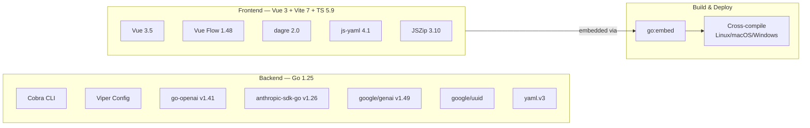

```
Backend (Go 1.25)                    Frontend (Vue 3 + Vite 7 + TS 5.9)
├── cobra v1.10  — CLI framework     ├── vue 3.5        — UI framework
├── viper v1.21  — YAML config       ├── vue-flow 1.48  — graph canvas
├── go-openai v1.41 — OpenAI SDK     ├── dagre 2.0      — graph layout
├── anthropic-sdk v1.26 — Claude     ├── js-yaml 4.1    — YAML parsing
├── genai v1.49  — Gemini SDK        ├── jszip 3.10     — ZIP export
├── yaml.v3      — YAML marshal      └── vue-tsc 3.1    — type checking
├── uuid v1.6    — ID generation
└── x/term v0.40 — terminal utils    Build: go:embed + cross-compile
                                     Targets: linux/darwin/windows (amd64, arm64)
```

| Layer | Language | Type System | Key Dependencies |
|-------|----------|-------------|------------------|
| Backend | Go 1.25 | Compiled, static | Cobra, Viper, go-openai, anthropic-sdk-go, google/genai |
| Frontend | TypeScript 5.9 | Compiled (tsc), static | Vue 3, Vue Flow, dagre, js-yaml, JSZip |
| Config | YAML | Schema-validated | mapstructure tags (Go) ↔ TypeScript interfaces |
| Wire format | JSON | Runtime | Go `json:` tags ↔ TypeScript interface fields |
| Embedding | `//go:embed` | Build-time | Vue dist → Go binary |

**Deployment**:

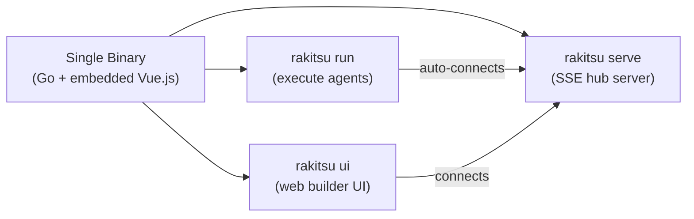

```
                   ┌─────────────────────────────────┐
                   │         Single Binary            │
                   │  (Go + embedded Vue.js frontend) │
                   └────────────────┬────────────────┘
                                    │
         ┌──────────────────────────┼──────────────────────┐
         │                          │                       │
  rakitsu run                   rakitsu serve              rakitsu ui
(execute agents)            (SSE hub server)         (web builder UI)
         │                          │                       │
         └────────── auto-connects to hub ─────────────────┘
```

---

## 2. Architecture Diagram

### Full System Architecture

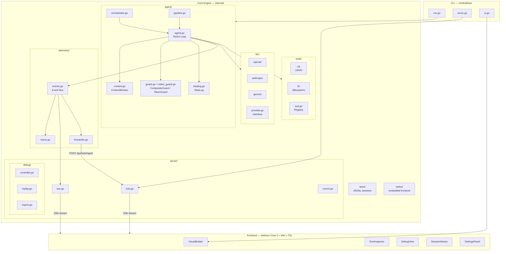

```
┌─────────────────────────────────────────────────────────────┐
│  CLI (cmd/rakitsu/)                                           │
│  ┌──────────┐  ┌──────────┐  ┌──────────┐                  │
│  │ run.go   │  │ serve.go │  │  ui.go   │                  │
│  └────┬─────┘  └────┬─────┘  └────┬─────┘                  │
└───────┼─────────────┼─────────────┼──────────────────────-─┘
        │             │             │
        ▼             ▼             ▼
┌────────────────────────────────────────────────────────────┐
│  Core Engine (internal/)                                    │
│                                                             │
│  ┌────────────┐  ┌────────────────────────────────────┐    │
│  │ config/    │  │  agent/                            │    │
│  │ config.go  │  │  ┌──────────┐ ┌─────────────────┐  │    │
│  │ YAML schema│──►  │ agent.go │ │orchestrator.go  │  │    │
│  └────────────┘  │  │ (ReAct)  │ │pipeline.go      │  │    │
│                  │  └────┬─────┘ └────────┬────────┘  │    │
│                  │  ┌────▼────────────────▼──────────┐ │    │
│                  │  │ ContextMonitor  StepLog         │ │    │
│                  │  │ CompositeGuard  TokenGuard      │ │    │
│                  │  └────────────────────────────────┘ │    │
│                  └────────────────────────────────────┘    │
│                                                             │
│  ┌────────────────────┐  ┌──────────────────────────────┐  │
│  │  llm/              │  │  tools/                      │  │
│  │  openai/ anthropic │  │  cli/ (shell)                │  │
│  │  gemini/ provider  │  │  fs/ (filesystem)            │  │
│  └────────────────────┘  └──────────────────────────────┘  │
│                                                             │
│  ┌────────────────────┐  ┌──────────────────────────────┐  │
│  │  telemetry/        │  │  server/                     │  │
│  │  events.go (bus)   │  │  sse.go hub.go runner.go     │  │
│  │  tracer.go         │  │  debug/ (controller, replay) │  │
│  │  forwarder.go      │  └──────────────────────────────┘  │
│  └────────────────────┘                                     │
│                                                             │
│  store/ (JSONL)    webui/ (embedded frontend)               │
└────────────────────────────────────────────────────────────┘
        │
        ▼
┌───────────────────────────────────────────────────────────┐
│  Frontend (web/src/)  [Vue 3 + Vite + TypeScript]         │
│  VisualBuilder  RunInspector  DebugView  SessionHistory    │
└───────────────────────────────────────────────────────────┘
```

### Component Interaction (Request Lifecycle)

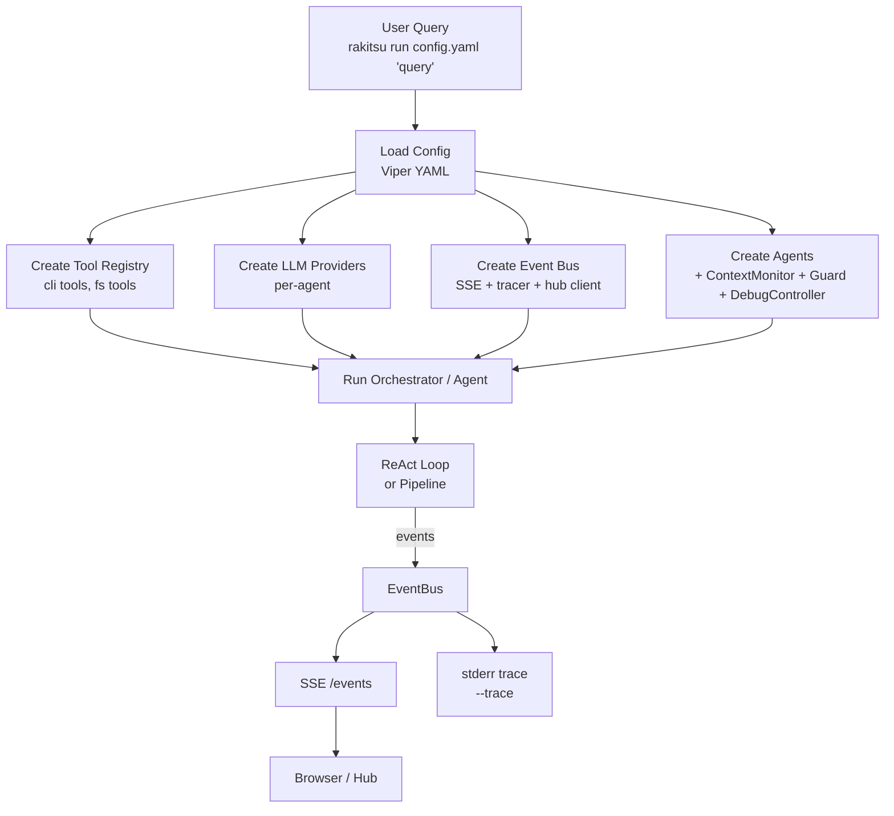

---

## 3. CLI Commands

11 top-level commands: `run`, `serve`, `ui` (deprecated), `version`, `sessions`, `export`, `scaffold`, `quickstart`, `doctor`, `acp`, `license` (pro builds only).

### `rakitsu run <config.yaml> <query>`

Execute agents for a given query.

| Flag | Default | Description |
|------|---------|-------------|
| `--timeout, -t` | 300s | Execution timeout (`<=0` disables it) |
| `--idle-timeout` | 0 (disabled) | Cancel the run after N seconds with no streaming activity |
| `--trace` | false | Color-coded trace to stderr |
| `--verbose, -v` | false | Print agent/model info (root persistent flag) |
| `--hub URL` | `http://localhost:9100` | Hub URL for event streaming |
| `--no-hub` | false | Run standalone (no hub) |
| `--debug-port N` | 0 | Standalone debug SSE server |
| `--interactive, -i` | false | Run as a chat TUI instead of one-shot |
| `--resume ID` | — | Resume a prior session by ID |
| `--workdir, -w` | cwd | Working directory for tool execution |
| `--provider NAME` | — | Override default provider for all agents |
| `--model NAME` | — | Override default model for all agents |
| `--max-tokens N` | 0 (config value) | Override max output tokens for all agents/orchestrators |
| `--max-cost` | 0 (disabled) | Abort run if total cost exceeds this USD amount |
| `--embedding-provider NAME` | — | Override embedding provider for context retrieval |
| `--attach PATH` | — | Attach a local image file to the query (repeatable; requires the agent's `vision: true`) |
| `--dry-run` | false | Estimate cost/tokens without calling the LLM |

### `rakitsu serve`

Start the SSE hub, web UI, runner, and debugger. Also serves an MCP server at `/mcp` and an A2A endpoint at `/a2a` (see §14).

| Flag | Default | Description |
|------|---------|-------------|
| `--port, -p` | 9100 | Hub/UI port |
| `--host` | localhost | Bind host (non-loopback requires `RAKITSU_API_TOKEN` — see [SECURITY.md](SECURITY.md)) |
| `--mcp-port N` | 0 (disabled) | Start the MCP HTTP server on this port (requires `--config`) |
| `--config PATH` | — | YAML config to load tools/agents from, for the MCP server and A2A endpoint |
| `--config-dir` | — | Extra directory to scan for agent configs in the UI |

### `rakitsu ui` — deprecated alias for `rakitsu serve`

Kept for backward compatibility; `serve` now includes the full web UI + runner.

| Flag | Default | Description |
|------|---------|-------------|
| `--port, -p` | 9100 | Hub/UI port |
| `--host` | localhost | Bind host |
| `--config-dir` | — | Extra config search path |

### `rakitsu acp <config.yaml>`

Run as an ACP (Agent Client Protocol) stdio server — the mechanism editors like Zed use to talk to rakitsu agents directly. See §14.

---

## 4. Configuration Schema

### Root Structure

```yaml
name: string
project_id: string           # optional
version: string
description: string
interactive: bool            # optional — run as chat TUI instead of one-shot
interactive_overlay: bool    # optional — wrap root runner in chat-host meta-agent (default: true for non-conversational configs)
force_delegation: bool       # optional — ChatHost must call invoke_config every turn
settings:
  default_provider: string
  providers: { name: ProviderDefinition }
  api_keys: { provider: key }
  base_urls: { provider: url }
  credentials_files: { provider: path }
  locations: { provider: region }
  projects: { provider: gcp_project }
  allowed_commands: [string]
  defaults: DefaultSettings
  execution: ExecutionSettings
  pricing: { model: PricingConfig }
tools: [ToolDefinition]
skills: [SkillDefinition]
agents: [AgentDefinition]
orchestrator: OrchestratorConfig
orchestrators: [OrchestratorConfig]  # optional — multiple named orchestrators
workflows: [WorkflowDefinition]      # optional
```

### Provider Resolution

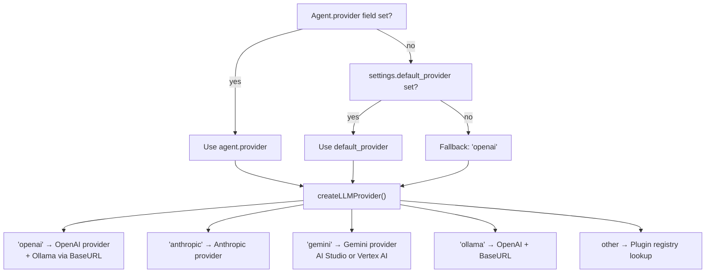

### Agent Definition

```yaml
agents:
  - name: "My Agent"
    role: "worker"           # or "supervisor"
    provider: "openai"       # optional, falls back to default
    model: "gpt-4o-mini"
    model_config:
      temperature: 0.7
      max_tokens: 4096
      no_stream_tools: false # true for vLLM/Qwen3 via LiteLLM
      timeout_sec: 30        # per-request LLM timeout
    system_prompt: "You are..."
    tools: ["tool_name"]
    settings:
      max_iterations: 10
      max_total_tokens: 50000  # per-agent token budget
      max_cost: 1.00           # per-agent cost budget (USD)
      reflection:
        enabled: true
        mode: "after_tool"     # after_tool | before_answer | both
        frequency: "always"    # always | on_error | every_n
        every_n: 3
      ground_check:
        enabled: false
        confidence_threshold: 0.7
        max_retries: 1
      context:
        strategy: "step_log"   # full | sliding_window | step_log
        keep_recent: 3         # step_log: steps kept verbatim
        window_size: 15        # sliding_window: turns to keep
        max_tool_output: 6000  # truncation limit (chars)
        fence_outputs: true    # wrap in <tool_output> tags
```

### Pipeline Configuration

```yaml
orchestrator:
  name: "Lead"
  strategy: "Pipeline"
  agents: ["Explorer", "Analyzer", "Reviewer"]
  pipeline:
    steps:
      - name: "explore"
        agent: "Explorer"           # sequential step
      - name: "analyze"
        agent: "Analyzer"           # sequential step
      - name: "review"
        type: "parallel"            # parallel step
        steps:
          - name: "code_review"
            agent: "Reviewer"
          - name: "security_scan"
            agent: "SecurityScanner"
```

---

## 5. Agent Engine (ReAct Loop)

### ReAct Loop Flowchart

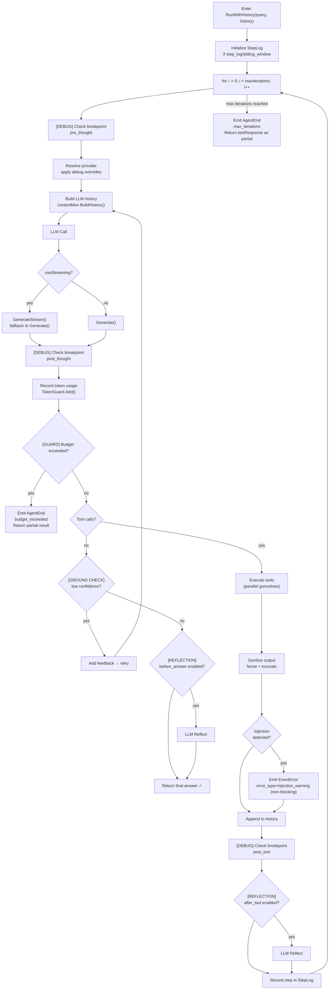

### Reflection Config

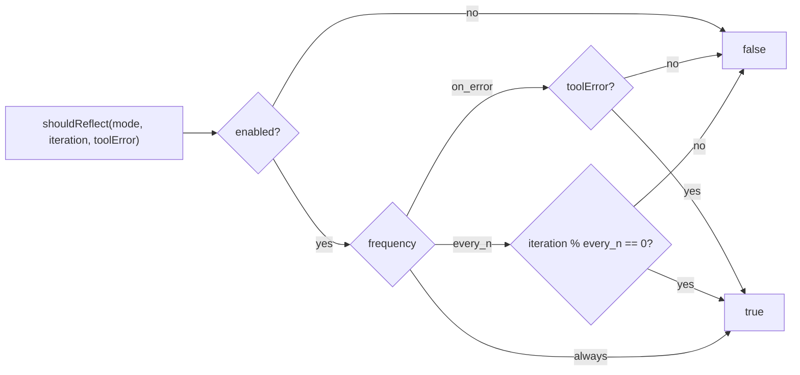

```
Enter RunWithHistory(query, history)
     │
     ├── Initialize StepLog (if step_log/sliding_window)
     │
     └── for i := 0; i < maxIterations; i++
              │
              ├── [DEBUG] Check breakpoint: pre_thought
              ├── Resolve provider (apply debug overrides)
              ├── Build LLM history (contextMon.BuildHistory)
              │
              ├── LLM Call
              │    ├── streaming → GenerateStream() [fallback to Generate]
              │    └── non-streaming → Generate()
              │
              ├── [DEBUG] Check breakpoint: post_thought
              ├── Record token usage → TokenGuard.Add()
              ├── [GUARD] Budget exceeded? → return partial result
              │
              ├── No tool calls?
              │    ├── [GROUND CHECK] low confidence? → retry
              │    ├── [REFLECTION] before_answer?
              │    └── Return final answer ✓
              │
              ├── Execute tools (parallel goroutines)
              │    ├── Validate tool → error with available names if missing
              │    ├── Sanitize (fence + truncate)
              │    ├── Detect injection → emit warning (non-blocking)
              │    └── Append to history
              │
              ├── [DEBUG] Check breakpoint: post_tool
              ├── [REFLECTION] after_tool?
              └── Record step in StepLog

     max_iterations reached:
     └── Return lastResponse as partial result (no error)
```

### Ground Check Config

```
GroundCheckConfig
├── enabled: bool
├── confidence_threshold: float64 (0.0-1.0, default 0.7)
├── max_retries: int (default 1)
└── prompt: string (optional)

On low confidence:
  → Add feedback to history
  → Continue loop (retry)
```

---

## 6. Orchestration Strategies

### Strategy Comparison

| Strategy | Control | Determinism | Use Case |
|----------|---------|-------------|----------|
| **ReAct** | LLM-driven | Non-deterministic | Open-ended tasks |
| **Pipeline** | Config-driven | Deterministic | Structured workflows |
| **Hierarchical** | Hybrid | Semi-deterministic | Large projects |
| **PlanAndExecute** | LLM-planned | Semi-deterministic | Complex multi-step |

### Pipeline Execution Timeline

```mermaid
gantt
    title Pipeline Execution (Sequential → Parallel)
    dateFormat  s
    axisFormat  %Ss

    section Sequential
    Explorer (Step 1)    : a1, 0, 3s
    Analyzer (Step 2)    : a2, after a1, 4s

    section Parallel (Step 3)
    Reviewer             : crit, b1, after a2, 3s
    SecurityScanner      : crit, b2, after a2, 4s

    section Done
    Pipeline Complete    : milestone, after b2, 0s
```

### Pipeline Step Flow

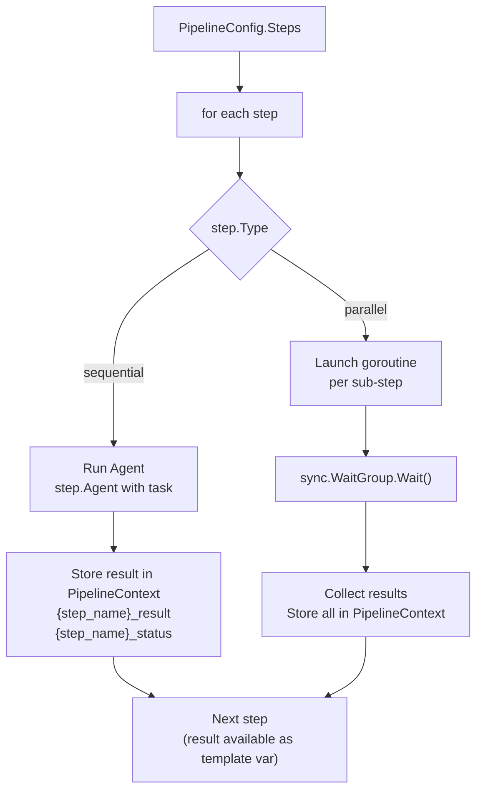

### ReAct Orchestrator Flow

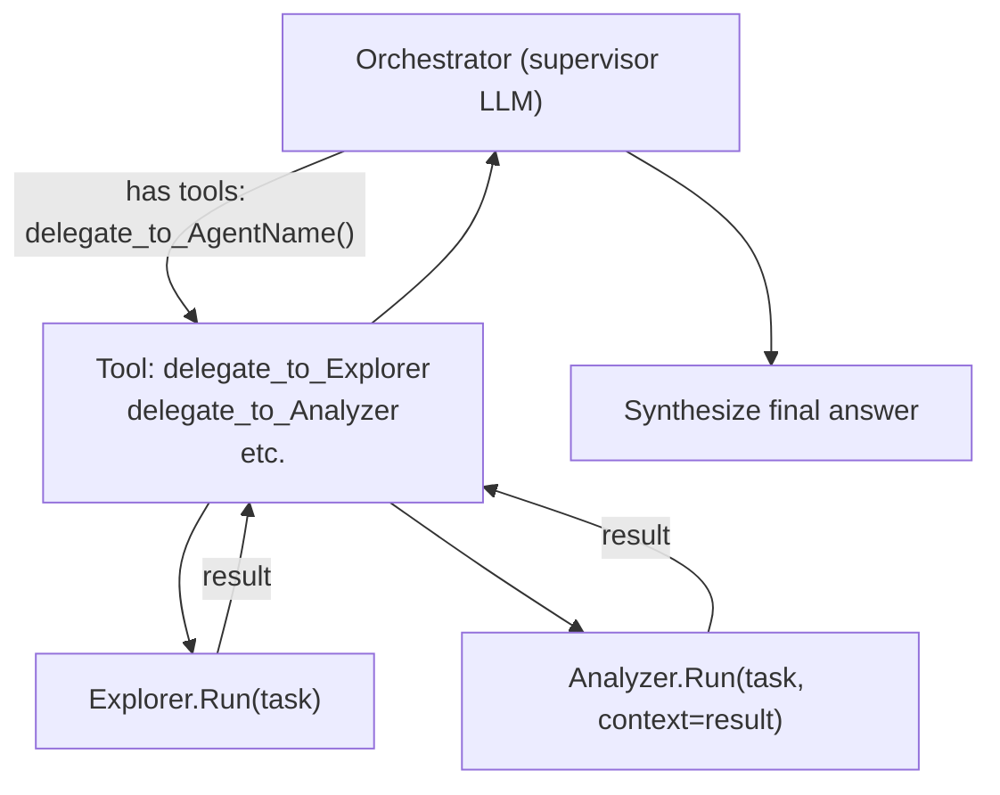

---

## 7. LLM Providers

### Provider Interface

```go
LLMProvider
├── Generate(ctx, systemPrompt, history, tools) (*GenerateResult, error)
├── GetName() string
└── GetModel() string

StreamingProvider (extends LLMProvider)
└── GenerateStream(ctx, systemPrompt, history, tools) (*StreamResult, error)

GenerateResult
├── Response     string          // Final text
├── ToolCalls    []ToolCall      // Structured calls
├── TokenUsage   *TokenUsage     // in/out/total
└── FinishReason string          // stop|tool_calls|length
```

### Provider Matrix

| Provider | Tool Calls | Streaming | Auth Method |
|----------|-----------|-----------|-------------|
| **OpenAI** | Native JSON | ✅ | API key |
| **OpenAI + Ollama** | Native JSON | ✅ | Base URL |
| **OpenAI + LiteLLM** | Native JSON | ✅ | Base URL + key |
| **vLLM/Qwen3 via LiteLLM** | `<tool_call>` XML | ⚠️ no_stream_tools | Base URL + key |
| **Anthropic** | Native JSON | ❌ | API key |
| **Gemini (AI Studio)** | Native JSON | ✅ | API key |
| **Gemini (Vertex AI)** | Native JSON | ✅ | Service account / ADC |

### vLLM/Qwen3 Tool Call Parsing

Some models (e.g., vLLM-hosted Qwen3) embed tool calls as XML in content:

```xml
<tool_call>{"name": "read_file", "arguments": {"path": "foo.py"}}</tool_call>
```

The OpenAI provider auto-detects and parses these when no standard `tool_calls` array is present. Set `no_stream_tools: true` to disable streaming (LiteLLM strips XML tags during streaming).

### Gemini Auth Resolution

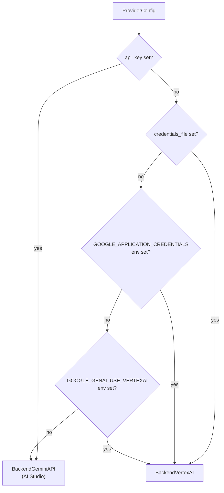

---

## 8. Tools & Security

### Tool Types

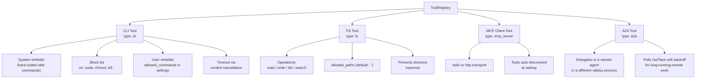

See §14 for the ACP/MCP/A2A protocol details (both directions: rakitsu as a client via these tool types, and rakitsu as a server via `rakitsu acp` / `rakitsu serve --mcp-port` / `rakitsu serve` `/a2a`).

### Tool Execution Flow (Parallel)

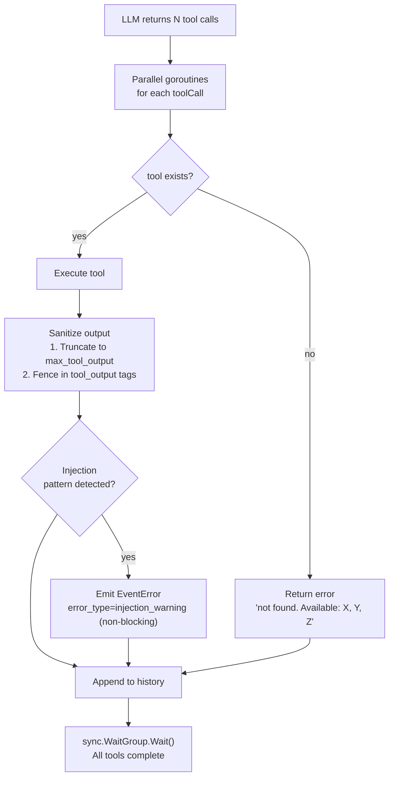

### Security Model — Output Fencing

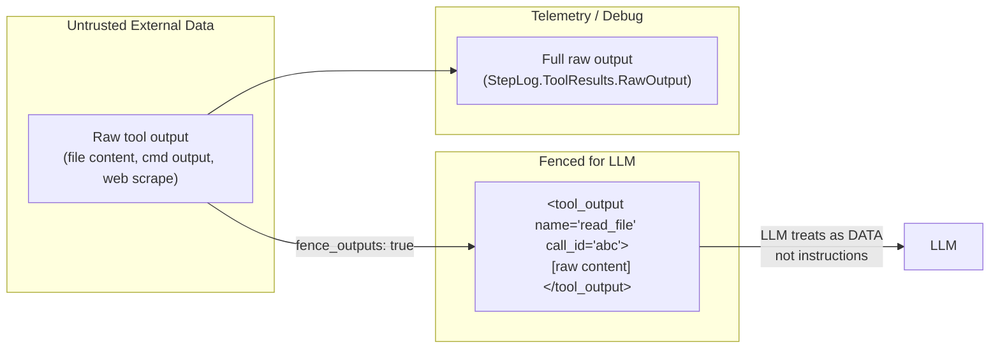

---

## 9. Context Management

### Strategy Comparison

| Strategy | How it works | Context size |
|----------|-------------|--------------|
| `full` | Keep all history | Unbounded (grows with iterations) |
| `sliding_window` | Keep last N turns | `window_size` turns max |
| `step_log` | Query + summaries + recent full | Bounded regardless of iteration |

### step_log BuildHistory

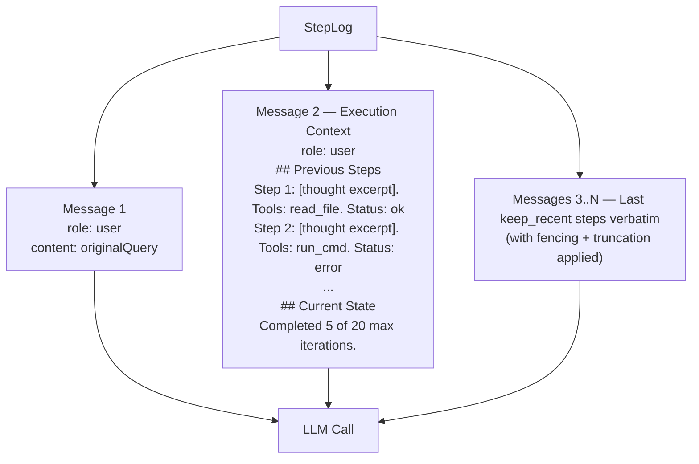

### Context Strategies — Context Growth Over Iterations

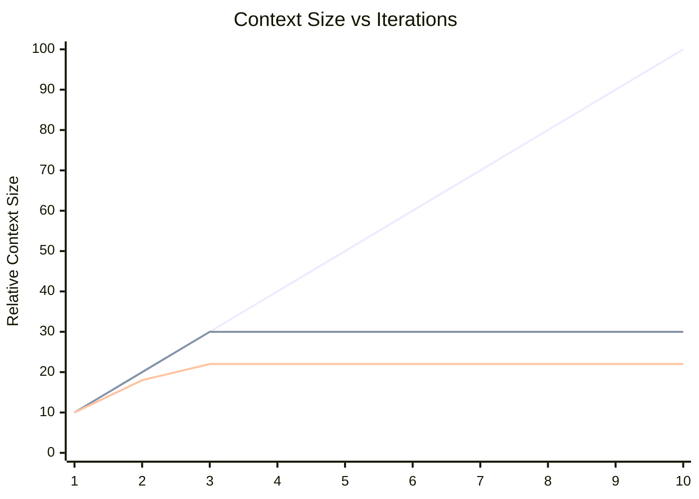

> `full` (growing) · `sliding_window` (capped at window_size) · `step_log` (bounded after keep_recent)

### Output Fencing (fence_outputs: true)

```
Raw tool output:
  "def foo(): return 42"

Fenced output in history:
  <tool_output name="read_file" call_id="tc_0">
  def foo(): return 42
  </tool_output>
```

### StepLog Types

```go
StepLog { Query string; Steps []Step }

Step {
  Iteration   int
  Thought     string
  ToolCalls   []llm.ToolCall
  ToolResults []ToolOutput
  Reflection  string
  TokensIn    int
  TokensOut   int
}

ToolOutput {
  CallID    string
  ToolName  string
  RawOutput string  // full untruncated (for telemetry)
  Error     string
  Duration  int64
}
```

---

## 10. Guard System (Budgets)

### Guard Hierarchy

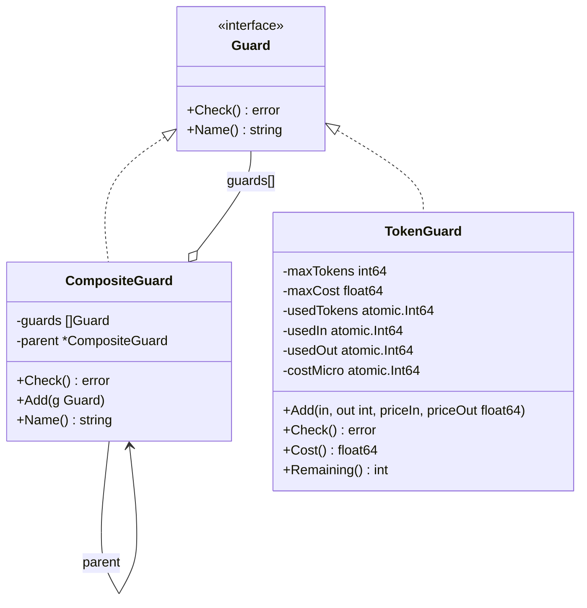

### Hierarchical Budget Enforcement

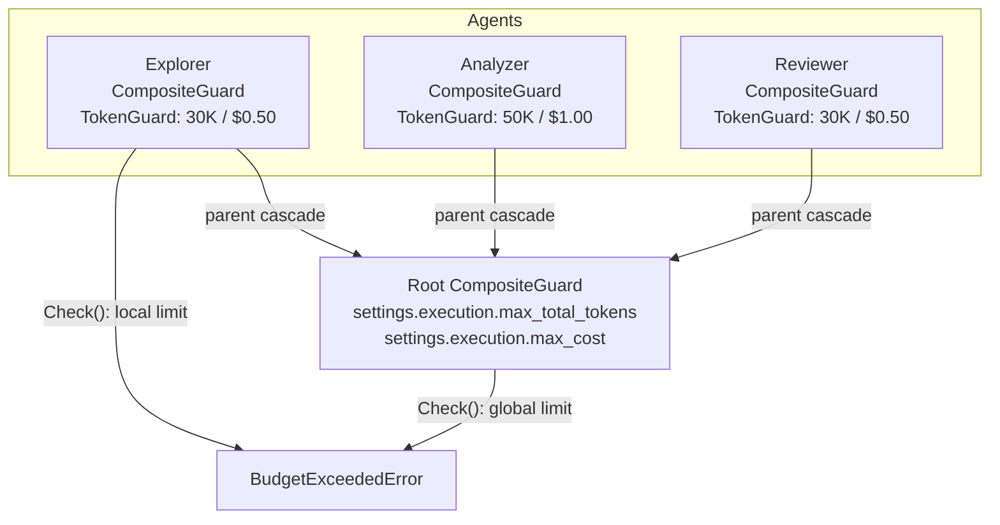

### Budget Exceeded Behavior

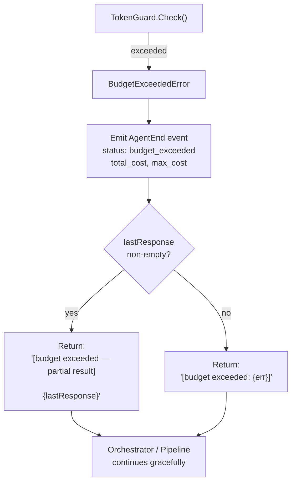

### Default Pricing Table

| Model | Input ($/1M) | Output ($/1M) |
|-------|-------------|--------------|
| `gpt-4o` | $2.50 | $10.00 |
| `gpt-4o-mini` | $0.15 | $0.60 |
| `claude-sonnet-4-5` | $3.00 | $15.00 |
| `claude-opus-4-6` | $15.00 | $75.00 |
| `claude-haiku-4-5` | $0.80 | $4.00 |
| `gemini-2.5-pro` | $1.25 | $10.00 |
| `gemini-2.5-flash` | $0.15 | $0.60 |
| `gemini-3.1-flash-lite-preview` | $0.075 | $0.30 |

Override in config:
```yaml
settings:
  pricing:
    my-custom-model:
      input: 0.50
      output: 2.00
```

---

## 11. Telemetry & Events

### Event Flow

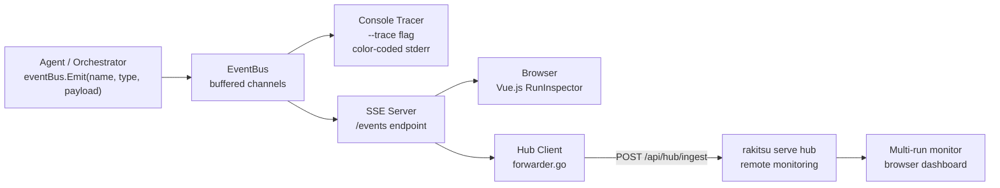

### All Event Types

| Event | Trigger | Key Payload Fields |
|-------|---------|-------------------|
| `AGENT_START` | Agent begins | name, role, model, tools |
| `AGENT_END` | Agent finishes | status, iterations, total_tokens, total_cost |
| `THOUGHT_START` | Before LLM call | iteration, tool_count |
| `THOUGHT_END` | After LLM response | thought, tool_calls, finish_reason |
| `TOOL_CALL_START` | Before tool exec | tool_name, call_id, arguments |
| `TOOL_CALL_END` | After tool exec | tool_name, call_id, output, duration_ms |
| `REFLECTION_START` | Before reflection | iteration, mode |
| `REFLECTION_END` | After reflection | reflection_text |
| `GROUND_CHECK_START` | Before validation | iteration |
| `GROUND_CHECK_END` | After validation | confidence, valid, issues |
| `AGENT_HANDOFF` | Delegation | from, to, task, context |
| `AGENT_MESSAGE` | Inter-agent msg | message, type |
| `TOKEN_USAGE` | After LLM call | input, output, total tokens |
| `ERROR` | Any error | error_type, message, recoverable |
| `EXECUTION_COMPLETE` | Run ends | status, final_answer, duration_ms |
| `PIPELINE_START` | Pipeline begins | steps |
| `PIPELINE_END` | Pipeline ends | status |
| `PIPELINE_STEP_START` | Step begins | name, type |
| `PIPELINE_STEP_END` | Step ends | name, status, result |
| `DEBUG_PAUSED` | Breakpoint hit | checkpoint, iteration, thought |
| `DEBUG_RESUMED` | Execution resumed | action |
| `TOKEN_CHUNK` | Streaming token | content |
| `REPLAY_START` | Replay begins | session_id |
| `REPLAY_END` | Replay ends | — |

### Event Timeline (Example Run)

```mermaid
timeline
    title Single Agent ReAct Execution Events
    section Startup
        AGENT_START      : Agent initialized
                         : model, tools, settings
    section Iteration 1
        THOUGHT_START    : LLM call begins
        TOKEN_CHUNK      : streaming tokens
        THOUGHT_END      : response + tool calls
        TOOL_CALL_START  : tool executing
        TOOL_CALL_END    : tool result ready
        REFLECTION_END   : post-tool reflection
    section Iteration 2
        THOUGHT_START    : LLM call begins
        THOUGHT_END      : final answer (no tools)
    section Completion
        TOKEN_USAGE      : total token summary
        AGENT_END        : status success
        EXECUTION_COMPLETE : run finished
```

### AgentEndPayload

```go
AgentEndPayload {
  Status      string  // "success" | "error" | "max_iterations" | "budget_exceeded"
  FinalAnswer string
  Iterations  int
  TotalTokens int
  TotalCost   float64 // USD (if pricing configured)
  MaxTokens   int     // configured limit
  MaxCost     float64 // configured limit
}
```

### Session Storage

```
~/.rakitsu/sessions/{session_id}.jsonl
Line 1: SessionMeta (JSON)
Line 2+: AgentEvent (JSON, one per line)

SessionMeta {
  ID, Name, Query, ConfigPath, Agents []string
  StartTime, EndTime, Status
  TotalTokens, TotalEvents, DurationMs
}
```

---

## 12. Real-Time Debugging

### Debug System Overview

```mermaid
flowchart TD
    CMD["rakitsu run --debug-port 9200 config.yaml 'query'"]
    CMD --> DC["DebugController\ncreated + attached to each agent"]
    DC --> LOOP["Agent ReAct Loop\ndebugCtrl.Check() at checkpoints"]
    DC --> SSED["SSE Debug Server\n/debug/events"]
    LOOP -->|pause at breakpoint| BLOCK["Block on resumeCh"]
    SSED -->|stream events| BROWSER["Browser DebugView.vue"]
    BROWSER -->|"POST /debug/resume\nPOST /debug/set_breakpoint\nPOST /debug/set_params"| SSED
    SSED -->|send command| DC
    DC -->|unblock| BLOCK
```

```
States: running → paused → stepping → running

  ┌───────────────────────────────────────────────────────┐
  │                      Running                          │
  │  Check() → nil (fast path, zero overhead)             │
  └────────────────────┬──────────────────────────────────┘
                       │ breakpoint hit / pause command
                       ▼
  ┌───────────────────────────────────────────────────────┐
  │                      Paused                           │
  │  Check() → blocks on resumeCh                         │
  │                                                       │
  │  Resume(action):                                      │
  │    ActionResume   → Running                           │
  │    ActionStep     → Stepping                          │
  │    ActionStepIn   → Running (pause at child)          │
  │    ActionStepOut  → Running (pause at parent)         │
  │    ActionRunUntil → Running (set condition)           │
  │    ActionStop     → return error (halt execution)     │
  └────────────────────┬──────────────────────────────────┘
                       │ ActionStep
                       ▼
  ┌───────────────────────────────────────────────────────┐
  │                     Stepping                          │
  │  next Check() → emit DEBUG_PAUSED → Paused            │
  └───────────────────────────────────────────────────────┘
```

### Debug Controller State Machine

```mermaid
stateDiagram-v2
    [*] --> Running : NewDebugController()

    Running --> Paused : breakpoint hit\nor pause command
    Running --> Running : Check() → nil (fast path)

    Paused --> Running : Resume(ActionResume)
    Paused --> Stepping : Resume(ActionStep)
    Paused --> Running : Resume(ActionStepIn)\n(pause at first child checkpoint)
    Paused --> Running : Resume(ActionStepOut)\n(pause when back at parent)
    Paused --> Running : Resume(ActionRunUntil)\nset RunUntilCondition
    Paused --> [*] : Resume(ActionStop)\nreturn error

    Stepping --> Paused : next Check() hit\nemit DEBUG_PAUSED
```

### Breakpoints

```go
BreakpointKey { EventType string; AgentName string }
// AgentName == "" means wildcard (all agents)

Checkpoint names:
  "pre_thought"   → before each LLM call
  "post_thought"  → after LLM response
  "post_tool"     → after tool execution
  "pre_step"      → before pipeline step
  "post_step"     → after pipeline step
```

### Parameter Overrides

```go
ParamOverride {
  Temperature   *float64
  MaxTokens     *int
  Model         *string
  SystemPrompt  *string
  MaxIterations *int
  Tools         []string
  Sticky        bool  // persist across iterations if true
}
```

### Debug HTTP API

```
GET  /debug/events          → SSE stream of debug events
POST /debug/pause           → Pause execution
POST /debug/resume          → Resume with action
POST /debug/set_breakpoint  → Add/remove breakpoint
POST /debug/set_params      → Set parameter overrides
GET  /debug/replay          → Stream replay events
GET  /debug/export          → Download config with overrides
```

---

## 13. Hub Architecture

`rakitsu serve` mounts more than the hub: alongside the SSE/hub endpoints
below, it also serves an MCP server at `/mcp` (with `--mcp-port` + `--config`)
and an A2A endpoint at `/a2a` + `/.well-known/agent-card.json` (with
`--config`) on the same or a separate port. See §14 for the protocol details.

```
rakitsu run (CLI)                       rakitsu serve (Hub)          Browser
       │                                      │                      │
       │  POST /api/hub/register              │                      │
       │ ────────────────────────────────────►│ Add to activeSessions│
       │                                      │                      │
       │  [loop: every 500ms]                 │                      │
       │  POST /api/hub/ingest [events]        │                      │
       │ ────────────────────────────────────►│ Broadcast via SSE ──►│
       │                                      │                      │
       │  [loop: command polling]             │                      │
       │  GET /api/hub/commands?session=X     │                      │
       │ ◄────────────────────────────────────│                      │
       │  (execute debug command)             │                      │
       │                                      │◄─────────────────────│
       │                                      │  POST /api/hub/command
       │                                      │  {session, action}   │
       │  POST /api/hub/deregister            │                      │
       │ ────────────────────────────────────►│ Mark complete ──────►│
```

### Hub Communication Flow

```mermaid
sequenceDiagram
    participant CLI as rakitsu run (CLI)
    participant HUB as rakitsu serve (Hub)
    participant Browser

    CLI->>HUB: POST /api/hub/register\n{sessionId, name, agents}
    HUB-->>CLI: 200 OK + sessionId

    loop Event Batching (every 500ms)
        CLI->>HUB: POST /api/hub/ingest\n[AgentEvent, ...]
        HUB-->>Browser: SSE broadcast\nall session events
    end

    loop Debug Commands (polling)
        CLI->>HUB: GET /api/hub/commands?session=X
        HUB-->>CLI: [DebugCommand, ...]
        CLI->>CLI: Execute debug command\n(pause, set_breakpoint, etc.)
    end

    Browser->>HUB: GET /events (SSE)
    HUB-->>Browser: All active session events

    Browser->>HUB: POST /api/hub/command\n{session, action, params}
    HUB-->>CLI: (via command queue)

    CLI->>HUB: POST /api/hub/deregister
    HUB-->>Browser: Session marked complete
```

### Hub Session Management

```go
ActiveSession {
  ID         string        // UUID
  Name       string        // Config name
  Query      string
  Agents     []string
  StartTime  time.Time
  Status     string        // "running" | "completed" | "error"
  Debug      bool          // Has debug attach
  EventCount int
}
```

### Auto-Connect Logic (CLI)

```mermaid
flowchart TD
    START["rakitsu run (no --no-hub, no --debug-port)"]
    START --> HEALTH["GET http://localhost:9100/health"]
    HEALTH --> OK{"200 OK?"}
    OK -->|yes| REG["Register with hub\nForward events via ingest"]
    OK -->|no| STANDALONE["Run standalone\n(no error — silent skip)"]
```

---

## 14. Protocol Interop (ACP / MCP / A2A)

rakitsu speaks three external agent/tool protocols, in both directions.

### ACP (Agent Client Protocol) — `rakitsu acp <config.yaml>`

Runs rakitsu as a stdio JSON-RPC server so editors that speak ACP (e.g. Zed)
can drive rakitsu agents directly — session create, prompt turns, streaming
updates. Implementation: `internal/acp/`. Session history is truncated
rune-safe at storage time to bound memory on long-running sessions.

### MCP server — `rakitsu serve --mcp-port N --config <config.yaml>`

Exposes rakitsu's registered tools as an MCP server at `POST /mcp` (also
mounted on the main `serve` port). Implementation: `internal/server/mcp.go`.
Spec-compliant for the **legacy MCP era** (protocol revisions through
2025-11-25): `Mcp-Session-Id` is required and validated (400/404 on
missing/unknown), `protocolVersion` is negotiated against the versions
rakitsu supports rather than hardcoded, and `Origin` is checked as a
DNS-rebinding guard (403 on a disallowed origin). The **modern MCP era**
(2026-07-28 revision) is not yet implemented. `RAKITSU_API_TOKEN` gates
`/mcp` and `/a2a` on the main `serve` port; the standalone `--mcp-port`
listener mounts the MCP server at `/mcp` only (`server.MCPListenerHandler`),
so every other path on that listener is a 404 and the token gate cannot be
sidestepped by path.

### MCP client — tool type `mcp_server`

An agent can also call *out* to another MCP server as a tool (§8, §4).
Implementation: `internal/tools/mcp/`. Supports both `stdio` (subprocess) and
`http` transports.

### A2A (Agent-to-Agent) — `rakitsu serve --config <config.yaml>` (`/a2a`)

Exposes rakitsu agents as A2A v1.0.1 agents: `POST /a2a` (JSON-RPC,
PascalCase methods — `SendMessage`, `GetTask`, `CancelTask`) plus Agent Card
discovery at `GET /.well-known/agent-card.json`. Implementation:
`cmd/rakitsu/a2a_serve.go`. A remote request selects which local agent to
run via the spec's `tenant` field, repurposed for that; task state is
tracked in a capped in-memory store (no persistence across restarts).
Streaming (`SendStreamingMessage`), push-notification config, and AgentCard
JWS signing are out of scope. The `a2a` tool type (§8, §4) is the client
side — an agent delegates to a named agent in a different rakitsu process,
polling `GetTask` with backoff while the remote task is
`TASK_STATE_WORKING`/`SUBMITTED`.

---

## 15. Frontend

### Component Map

```
web/src/
├── components/
│   ├── builder/
│   │   ├── VisualBuilder.vue    # Vue Flow canvas
│   │   ├── NodeEditor.vue       # Node config panel
│   │   └── SettingsPanel.vue    # Global settings editor
│   ├── nodes/
│   │   ├── AgentNode.vue        # Agent node (Vue Flow)
│   │   ├── ToolNode.vue
│   │   ├── SkillNode.vue
│   │   └── OrchestratorNode.vue
│   ├── inspector/
│   │   ├── RunInspector.vue     # Real-time execution tree
│   │   └── EventItem.vue        # Event renderer
│   └── debugger/
│       ├── DebugView.vue        # Main debug UI
│       ├── HierarchyTree.vue    # Agent hierarchy
│       ├── ExecutionGraph.vue   # Visual graph
│       ├── DetailPanel.vue      # Selected node details
│       ├── BreakpointBar.vue    # Debug controls toolbar
│       └── AgentSettingsEditor.vue  # Runtime param editor
├── composables/
│   ├── useEventStream.ts        # SSE connection
│   ├── useDebugControl.ts       # Breakpoints, params
│   ├── useAgentRun.ts           # Launch + monitor
│   ├── useYamlExport.ts         # YAML generation
│   ├── useModularConfig.ts      # Modular file discovery
│   ├── useSessionHistory.ts     # Past sessions
│   ├── useDebugTree.ts          # Tree data management
│   └── useDebugGraph.ts         # Graph rendering
└── types/
    ├── events.ts                # TypeScript event types
    └── config.ts                # TypeScript config types
```

### Frontend Data Flow

```mermaid
flowchart TD
    SSE["SSE /events stream"]
    SSE --> UES["useEventStream.ts\nRef&lt;AgentEvent[]&gt;"]
    UES --> RI["RunInspector.vue\nReal-time event tree"]
    UES --> DV["DebugView.vue\nDebug graph + hierarchy"]

    UES --> UDT["useDebugTree.ts\ntree state mgmt"]
    UES --> UDG["useDebugGraph.ts\ngraph node/edge updates"]

    UDT --> HT["HierarchyTree.vue"]
    UDG --> EG["ExecutionGraph.vue"]

    UDC["useDebugControl.ts"] --> BB["BreakpointBar.vue"]
    UDC -->|"POST /debug/resume\nPOST /debug/pause\nPOST /debug/set_breakpoint"| DEBUG_API["Debug HTTP API"]
    UDC --> ASE["AgentSettingsEditor.vue\nRuntime param overrides"]
    ASE -->|"POST /debug/set_params"| DEBUG_API
```

### SSE Event Stream (Browser)

```typescript
// useEventStream.ts
const { events, status } = useEventStream(serverUrl)

// Status: "connecting" | "connected" | "disconnected" | "error"
// events: Ref<AgentEvent[]>
```

### Debug Toolbar

```
[▶ Resume] [⏭ Step] [↓ Step In] [↑ Step Out] [➡ Run Until ▾] [⏸ Pause] [⏹ Stop]
```

---

## 16. Extension Points

### New Tool Type

1. Create `internal/tools/<type>/tool.go` implementing `tools.Tool` interface
2. Register in `cmd/rakitsu/run.go` `createToolRegistry()` switch
3. Register in inline tools handling in multi-agent path

```go
type Tool interface {
  GetName() string
  GetDescription() string
  GetParametersSchema() map[string]interface{}
  Execute(ctx context.Context, args map[string]interface{}) (string, error)
}
```

### New LLM Provider (Built-in)

1. Create `internal/llm/<name>/provider.go` implementing `llm.LLMProvider`
2. Add case in `createLLMProvider()` switch in `cmd/rakitsu/run.go`

### New LLM Provider (Plugin)

`RegisterProviderFactory` lives in `package main` (`cmd/rakitsu/run.go`), which
Go does not allow any other module to import — so this isn't an out-of-tree
plugin loaded at runtime. It's a compile-time registration hook: add a file
to `cmd/rakitsu/` (in a fork, or a vendored build) that calls it from `init()`:

```go
// A file added to cmd/rakitsu/ itself (package main):
func init() {
  RegisterProviderFactory("my-provider", func(ctx context.Context, cfg *llm.ProviderConfig) (llm.LLMProvider, error) {
    return NewMyProvider(cfg), nil
  })
}
```

### New Event Type

1. Add constant to `internal/telemetry/events.go`
2. Add payload struct
3. Mirror in `web/src/types/events.ts`
4. Handle in `web/src/components/inspector/EventItem.vue`

### New Vue Flow Node

1. Create `web/src/components/nodes/<Type>Node.vue`
2. Export from `nodes/index.ts`
3. Add config type to `web/src/types/config.ts`
4. Integrate in VisualBuilder (toolbar + connections + export/import)

### Extension Architecture

```mermaid
graph LR
    subgraph Core["Rakitsu Core"]
        TOOL_IF["tools.Tool interface"]
        LLM_IF["llm.LLMProvider interface"]
        EVT_BUS["EventBus"]
        REG["Provider Registry\nRegisterProviderFactory()"]
    end

    subgraph Custom["Your Extensions"]
        MY_TOOL["my-tool/tool.go\nimplements Tool"]
        MY_PROV["my-provider/provider.go\nimplements LLMProvider"]
        MY_EVT["New EventType\n+ TS mirror"]
    end

    MY_TOOL -->|registered via switch| TOOL_IF
    MY_PROV -->|registered via init| REG
    REG --> LLM_IF
    MY_EVT --> EVT_BUS
```

---

## 17. Build & Development

### Makefile Targets

```bash
make build              # Go binary → bin/rakitsu
make frontend           # Vue.js → web/dist/
make build-embedded     # frontend + embed + Go binary (production)
make build-all          # Cross-compile macOS/Linux/Windows
make test               # go test -v ./...
make lint               # go vet + golangci-lint
make dev                # Hot reload (requires air)
make clean              # Remove build artifacts
```

### Version Injection

```bash
# Format: v{major}.{minor}.{patch}-alpha.{N}.{build}
# ({build} is branch-aware: short commit hash on main, commit count elsewhere)
make build VERSION=v0.2.0-alpha.3

# Runtime output:
rakitsu version v0.2.0-alpha.3.30132e9
```

### Project Structure

```
rakitsu/
├── cmd/rakitsu/              # CLI entrypoints
│   ├── root.go             # Cobra root command
│   ├── run.go              # rakitsu run (agent execution)
│   ├── serve.go            # rakitsu serve (hub)
│   └── ui.go               # rakitsu ui (web)
├── internal/
│   ├── agent/              # ReAct loop, orchestrator, pipeline
│   │   ├── agent.go        # Core ReAct loop
│   │   ├── orchestrator.go # Multi-agent supervisor
│   │   ├── pipeline.go     # Pipeline strategy
│   │   ├── context.go      # ContextMonitor
│   │   ├── steplog.go      # StepLog types
│   │   ├── guard.go        # Guard interface + CompositeGuard
│   │   ├── token_guard.go  # TokenGuard (thread-safe)
│   │   └── pricing.go      # Default pricing table
│   ├── config/             # YAML schema and parsing
│   ├── llm/                # LLM provider interface + impls
│   │   ├── provider.go     # Interface + override wrapper
│   │   ├── openai/         # OpenAI + Ollama + vLLM
│   │   ├── anthropic/      # Anthropic Claude
│   │   └── gemini/         # Google Gemini (AI Studio + Vertex AI)
│   ├── tools/              # Tool interface + implementations
│   │   ├── tool.go         # Interface + registry
│   │   ├── cli/            # Shell command tool
│   │   └── fs/             # Filesystem tool
│   ├── telemetry/          # Events, bus, tracer, forwarder
│   ├── server/             # HTTP server, SSE, hub, runner
│   ├── debug/              # Debug controller, replay, export
│   ├── store/              # Session persistence (JSONL)
│   └── webui/              # Embedded frontend (//go:embed)
├── web/                    # Vue.js frontend
│   └── src/
│       ├── components/     # UI components
│       ├── composables/    # Vue composables
│       └── types/          # TypeScript types
├── examples/               # Reference YAML configs
│   ├── reference/          # Modular example configs
│   └── dev-team/           # Multi-agent dev team example
├── test/
│   ├── configs/            # Test YAML configs
│   ├── stress/             # Concurrency stress tests (11 tests)
│   └── workspace/          # Sample code for agent testing
└── docs/                   # Documentation and dev plans
    └── dev/plan/           # Implementation plans
```

### Modular Config Discovery (UI)

The web UI auto-discovers config files from a directory:

```
my-project/
├── config.yaml         → main config (references agents/ tools/ etc.)
├── agents/
│   └── my-agent.md     → system prompt (frontmatter: name, role, model, tools)
├── tools/
│   └── my-tool.yaml    → tool definition
├── prompts/
│   └── template.md     → reusable prompt
└── skills/
    └── my-skill.yaml   → skill definition
```

Agent `.md` files use YAML frontmatter:

```markdown
---
name: "MyAgent"
role: "worker"
model: "gpt-4o-mini"
tools:
  - "read_file"
settings:
  max_iterations: 10
  context:
    strategy: "step_log"
    fence_outputs: true
---

You are a helpful agent. [system prompt here]
```
